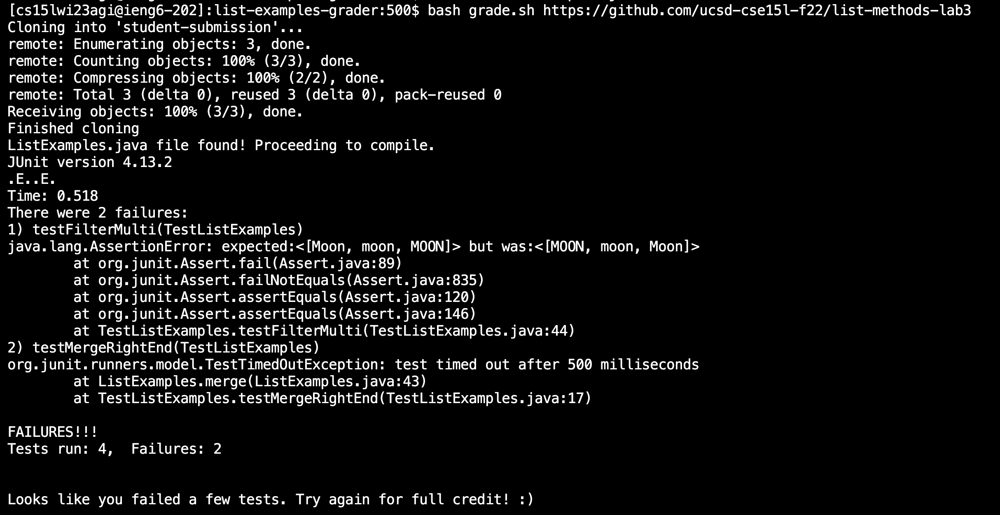
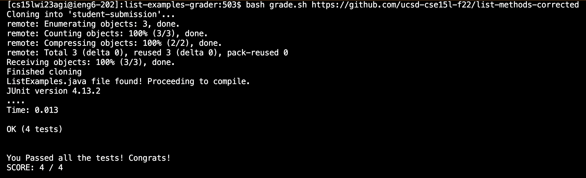
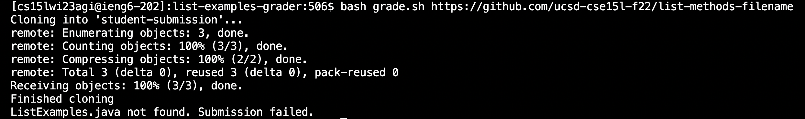
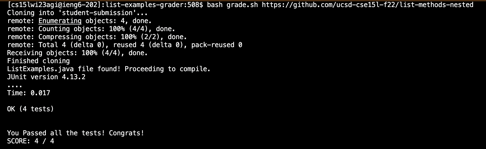

# Lab Report 5 - Lab Redo 
# Bash Grading Script
## Aaron Arellano

During lab in week 6, we were assigned the task of creating a bash script that takes in a github repository as a parameter (which needed to include a file
titled ListExamples.java) and then runs JUNIT tests against the student submitted files, assigning a grade to the student depending on the output of the 
tests. This entire script was to be in a file titled *grade.sh*. The final version of my script is seen below.

**grade.sh**

```
CPATH='.:lib/hamcrest-core-1.3.jar:lib/junit-4.13.2.jar'

rm -rf student-submission
git clone $1 student-submission
echo 'Finished cloning'

find student-submission > find_results.txt
FIND=`grep -r "ListExamples.java" find_results.txt`

if [[ -n $FIND ]]
then 
        echo "ListExamples.java file found! Proceeding to compile."
        cp $FIND .
        javac -cp $CPATH *.java
        java -cp $CPATH org.junit.runner.JUnitCore TestListExamples > result.txt
        fail=`grep -c FAILURES!!! result.txt`
        total=`grep -c "@Test" TestListExamples.java`
        if [[ fail -eq 0 ]]
        then
                LASTLINE=`grep "OK " result.txt`
                PASSED=${LASTLINE:4:1}
                cat result.txt
                echo ""
                echo "You Passed all the tests! Congrats!"
                echo "SCORE: $PASSED / $total"
                echo ""
        else
                cat result.txt
                echo ""
                echo "Looks like you failed a few tests. Try again for full credit! :)"
                echo ""
                exit
        fi

else
        echo "ListExamples.java not found. Submission failed."
        exit 
fi
```

The general steps that my script uses is as follows:
1. Removes any existing directory titled student-submission and then uses git clone to clone the new directory
2. Recursviely checks the directory to see if there is a file titled *ListExamples.java* 
3. If no such file exists, the script lets the user knoew and stops.
4. If it does exist, it then checks to see if any JUNIT tests failed.
5. If any tests failed, the script tells the user to debug and try again. 
6. Otherwise, the script counts how many tests passed and returns the grade of 100%

# Bash Script Examples

## Example 1 - list methods lab 3 repository

In this first repository, which was originally from lab 3, the ListExamples file had an issue with the filter method, which did not properly filter the
elements in the JUNIT array, as it incorrectly ordered the strings because of a faulty comparison in the method. The bash script was able to detect this
and let the user know that there was an issue with the outcome, prompting a resubmission.





## Example 2 - list methods corrected

In this second repository, the ListExamples.java file fixed the filter bug that was present in the previous example, and now correctly compares the strings, leading to the right order of the returned array. Therefore, because of the correct implementation, the script should tell the user that all of the tests passed and give them a passing score, as shown with the output of the script.





## Example 3 - list methods filename

In this third example, the repository contains a correct implementation of the filter and merge methods. However, in the repository, the file is under the
name of ListMethods and not ListExamples. Because of this, the script should report that the file could not be found, as shown below.





## Example 4 - list methods nested

In this last example, the repository contains the file ListExamples. However, when compared to other repositories, in here the file is located within another directory called pa1. Therefore in order to find and execute the file, the script would need to recursively search through the repository instead of simply looking through the initial files. Because my bash script uses grep -r to search for the file recursively in student-submission before executing, the script succesfully finds the file and tests it. In the end, all of the tests will pass and the submission gets 100, as shown below.





